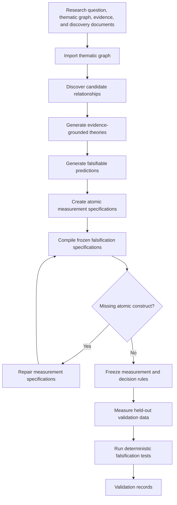

# Theory-discovery report

This is the minimal, review-ready package for the completed held-out run, built on the Prime orchestration architecture. It
contains the final results and frozen method contracts.

